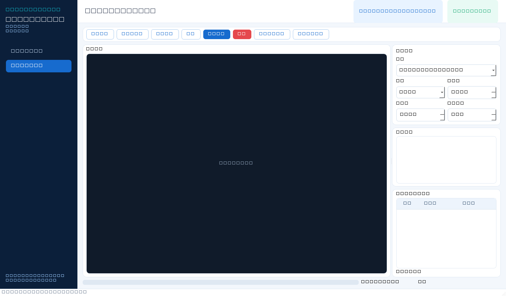
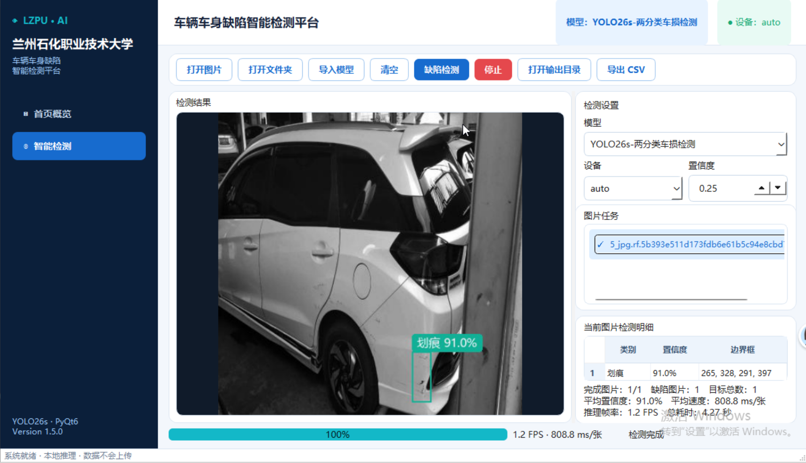

# YOLO26s 车辆车身缺陷检测与 PyQt6 可视化平台

这是一个面向深度学习初学者的完整目标检测工程。项目以车辆车身图片为对象，演示如何检查 YOLO 数据集、分析标签质量、生成两分类数据、训练与验证 YOLO26s、执行图片推理，并把训练好的权重封装到 Windows PyQt6 图形界面中。

> 推荐任务：检测 `dent（凹陷）` 与 `scratch（划痕）`  
> 运行原则：图片和检测结果均在本地处理，不上传到服务器





## 1. 这个仓库适合谁

- 第一次接触深度学习、目标检测或 YOLO 的学生。
- 想在自己的 Windows 电脑上复现车辆缺陷训练流程的人。
- 已经有 `.pt` 权重，只想运行图形化检测平台的人。
- 想学习如何把训练模型接入 PyQt6 桌面程序的人。

你不需要先掌握神经网络公式。建议按照教程顺序操作，每章都会解释“为什么做、输入是什么、会产生什么结果、怎样判断成功”。

## 2. 项目最终实现了什么

- 检查图片与标签是否一一对应、图片能否读取、YOLO 标签是否合法。
- 统计训练集和验证集的图片数、目标数、空标签及类别分布。
- 在不修改原始数据的前提下，将三分类数据派生为凹陷/划痕两分类数据。
- 使用配置文件启动 YOLO26s 训练、断点续训和独立验证。
- 对单张图片或整个文件夹执行推理。
- 提供两套可直接使用的内置模型。
- 提供两页面 PyQt6 GUI：首页概览与智能检测。
- GUI 支持模型选择、模型导入、中文检测框、文件夹批量处理、CSV 导出、速度显示和历史统计清空。

## 3. 已验证模型

推荐使用两分类模型 `models/YOLO26s_DentScratch_mAP50_73.18.pt`。

| 模型 | 类别 | Precision | Recall | mAP50 | mAP50-95 |
|---|---|---:|---:|---:|---:|
| YOLO26s 两分类 | dent、scratch | 89.15% | 68.66% | **73.18%** | 56.68% |
| YOLO26s 三分类实验 | dent、crack、scratch | 69.4% | 55.0% | 53.1% | 39.1% |

两分类中，dent 的 mAP50 为 56.9%，scratch 的 mAP50 为 89.4%。三分类的主要瓶颈是 crack 标签数量少、标注规则不一致，因此推荐模型删除了 crack 类。指标只代表当前验证集表现，不等于真实世界中永远有相同准确率。

详细分析见 [实验结果与改进建议](docs/12_实验结果与改进建议.md)。

## 4. 两条使用路线

### 路线 A：只想运行 GUI

适合暂时不训练、先体验检测平台的读者。仓库已经包含两份内置权重的数据分块；安装脚本会自动还原并校验为 `.pt`，无需手工下载权重。

```powershell
git clone https://github.com/zongshun21/car_damage.git
cd car_damage
Set-ExecutionPolicy -Scope Process Bypass
.\setup_gui_env.ps1
.\check_gui_env.ps1
.\start_gui.ps1
```

没有 NVIDIA 显卡时：

```powershell
.\setup_gui_env.ps1 -CpuOnly
```

安装只需执行一次，以后直接运行 `start_gui.ps1`。完整说明见 [GUI 安装运行与迁移](docs/10_GUI安装运行与迁移.md)。

### 路线 B：从数据开始完整训练

```powershell
git clone https://github.com/zongshun21/car_damage.git
cd car_damage
Set-ExecutionPolicy -Scope Process Bypass
.\setup_env.ps1
conda activate car_damage_yolo26
python scripts/check_dataset.py
python scripts/build_two_class_dataset.py
python scripts/train.py --config configs/train_two_class_768.yaml --batch 10
```

注意：`train_two_class_768.yaml` 为复现实验链路，会从前一阶段三分类微调权重继续训练。第一次完整复现请按照 [YOLO26s 模型训练](docs/06_YOLO26s模型训练.md) 的四阶段顺序执行，不要直接跳到最后一条命令。

## 5. 项目目录

```text
car_damage/
├─ assets/                 # README 使用的 GUI 与检测示例图
├─ configs/                # 数据集和训练超参数
├─ docs/                   # 从入门到 GUI 部署的分章教程
├─ models/                 # 两套内置权重与模型清单
├─ scripts/                # 数据检查、处理、训练、验证、推理、GUI入口
├─ src/car_damage/         # 可复用的核心 Python 代码
├─ tests/                  # 自动化测试
├─ setup_env.ps1           # 训练环境安装脚本
├─ setup_gui_env.ps1       # GUI 环境安装脚本
├─ check_gui_env.ps1       # GUI、CUDA、权重和启动检查
├─ start_gui.ps1           # GUI 启动脚本
├─ run_inference.ps1       # 推荐模型命令行推理入口
├─ environment.yml         # Conda 基础环境声明
└─ pyproject.toml          # Python 包和依赖声明
```

运行后还会出现以下目录，它们已被 `.gitignore` 排除：

- `车损车身数据集/`：原始数据。
- `.runtime/`：脚本生成的运行时 YAML 和派生数据集。
- `runs/`：训练权重、曲线、混淆矩阵和推理结果。
- `release/`：GUI 发布压缩包。

## 6. 下载并放置训练数据集

原始三分类数据集包含 5,700 张图片，压缩包约 168.65 MB。图片文件不直接存入 Git 仓库，可通过百度网盘下载：

- 文件名：`car_damage_dataset_3class_5700_20260903.zip`
- [百度网盘下载链接](https://pan.baidu.com/s/1sgKaATWPFbX11l_Z2tiHBA?pwd=may6)
- 提取码：`may6`
- SHA256：`91a8fe8eff1e6bb42a9f0e06b7f1bf8fa2d3c22c0320fd3fbb479f5351b45fa1`

把 ZIP 下载到项目根目录并解压。压缩包已经包含顶层目录 `车损车身数据集`，解压后应为：

```text
车损车身数据集/
├─ train/
│  ├─ images/             # 4,560 张训练图片
│  └─ labels/             # 同名 YOLO txt 标签
└─ val/
   ├─ images/             # 1,140 张验证图片
   └─ labels/             # 同名 YOLO txt 标签
```

在 PowerShell 中校验下载文件：

```powershell
Get-FileHash .\car_damage_dataset_3class_5700_20260903.zip -Algorithm SHA256
```

哈希一致后运行数据检查：

```powershell
conda activate car_damage_yolo26
python scripts/check_dataset.py --data configs/data.yaml
```

检查结果应包含 5,700 张图片，其中 train 4,560 张、val 1,140 张，并且没有阻塞训练的错误。三条零面积框警告会由项目处理流程过滤，详情见数据检查教程。

使用其他数据集也可以，但必须修改 `configs/data.yaml` 中的路径和类别。只有使用相同数据与训练设置，才可能接近仓库记录的指标。

数据仅用于本项目复现与学习。使用者仍需自行确认数据来源、隐私及再分发许可；网盘链接失效时请在仓库提交 Issue。

## 7. 完整教程导航

| 顺序 | 教程 | 学完后能够做什么 |
|---:|---|---|
| 1 | [深度学习与目标检测入门](docs/01_深度学习与目标检测入门.md) | 理解训练、推理、权重、边界框和 epoch |
| 2 | [环境安装与 GPU 检查](docs/02_环境安装与GPU检查.md) | 建立可用的 CPU/GPU Python 环境 |
| 3 | [数据集目录与 YOLO 标签格式](docs/03_数据集目录与YOLO标签格式.md) | 正确组织图片并读懂标签 |
| 4 | [数据检查与清洗](docs/04_数据检查与清洗.md) | 发现漏图、漏标、坏图和非法框 |
| 5 | [两分类数据集处理](docs/05_两分类数据集处理.md) | 安全生成 dent/scratch 派生数据 |
| 6 | [YOLO26s 模型训练](docs/06_YOLO26s模型训练.md) | 完成训练、续训并找到 best.pt |
| 7 | [模型验证与指标理解](docs/07_模型验证与指标理解.md) | 读懂 P、R、mAP 和混淆矩阵 |
| 8 | [图片推理与结果分析](docs/08_图片推理与结果分析.md) | 对新图片和文件夹执行推理 |
| 9 | [GUI 平台原理与封装](docs/09_GUI平台原理与封装.md) | 理解模型怎样进入 PyQt6 平台 |
| 10 | [GUI 安装运行与迁移](docs/10_GUI安装运行与迁移.md) | 在不同 Windows 设备运行平台 |
| 11 | [常见错误排查](docs/11_常见错误排查.md) | 根据错误现象定位环境、数据和界面问题 |
| 12 | [实验结果与改进建议](docs/12_实验结果与改进建议.md) | 理解当前上限以及下一步怎样提高精度 |

## 8. 模型文件校验

为兼容 GitHub 传输，仓库把大权重保存在 `models/weights_parts/`。`setup_gui_env.ps1`、`check_gui_env.ps1`、`start_gui.ps1` 和 `run_inference.ps1` 都会先调用 `restore_models.ps1`，在本机自动拼接并验证。也可手动执行：

```powershell
.\restore_models.ps1
```

还原后可在 PowerShell 中验证是否损坏：

```powershell
Get-FileHash .\models\YOLO26s_DentScratch_mAP50_73.18.pt -Algorithm SHA256
Get-FileHash .\models\YOLO26s_DentCrackScratch_mAP50_53.10.pt -Algorithm SHA256
```

正确哈希：

```text
两分类 d6ff9016c22e5de5117854d4c5fe8b0a37f041031187a3146c8f75087a22d07a
三分类 ba666ddbfd4a9f9da16e0bef2264797a1c0c02e8eec2f48d041753d042a553d2
```

## 9. 运行测试

```powershell
conda activate car_damage_yolo26
python -m pytest
```

当前工程共有 36 项测试，覆盖配置解析、数据检查、两分类转换、训练参数、推理工作线程、历史数据库、中文标注和 GUI 构建。涉及完整数据统计的测试要求本地已经放置原始数据集。

## 10. 已验证环境

- Windows 10/11
- Python 3.11
- PyTorch 2.5.1（CUDA 12.4 构建）
- torchvision 0.20.1
- Ultralytics 8.4.115
- Pillow 11.1.0
- PyQt6 6.11.0
- NVIDIA GeForce RTX 4090（训练与 GPU 验证机器）

CPU 设备也可以运行 GUI 和推理，但速度会更慢。PyTorch 官方安装选项见 [Start Locally](https://pytorch.org/get-started/locally/)，Ultralytics 模式说明见 [YOLO Modes](https://docs.ultralytics.com/modes/)。

## 11. 重要说明

- 本项目用于学习与工程实践，不应直接作为车辆保险定损或安全决策依据。
- GUI 只负责调用模型；界面美观不会提高模型准确率。
- `best.pt` 是验证表现最佳的权重，`last.pt` 是最后一轮权重，两者用途不同。
- 六个空标签属于背景图片，不等同于漏标；是否保留必须结合图片内容人工判断。
- 三个零面积框不提供有效定位监督，派生两分类数据时会被过滤。
- 不要使用验证集做数据增强或复制，否则会导致指标虚高。
